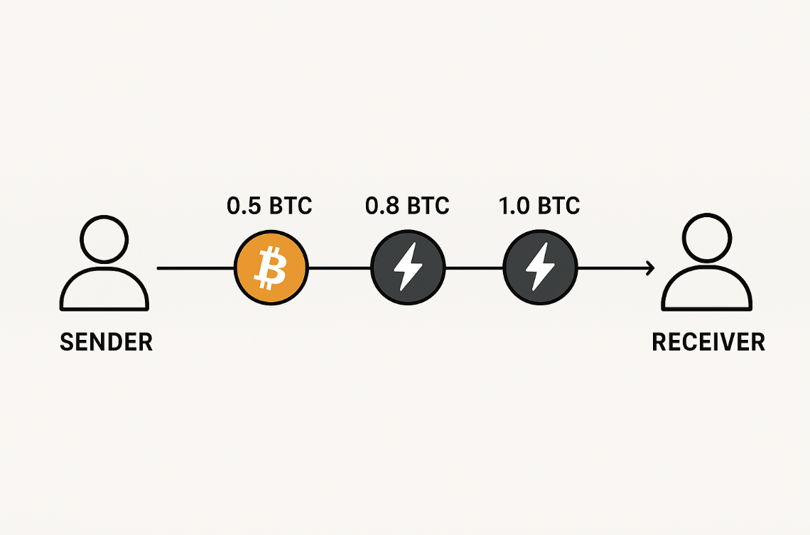

Table of contents
- [Blockchain (Bitcoin Network)](#blockchain-bitcoin-network)
- [Lightning Network](#lightning-network)
  - [Public and Private Keys](#public-and-private-keys)
  - [Hot Wallet](#hot-wallet)
  - [Cold Wallet](#cold-wallet)
    - [Strike Key Features](#strike-key-features)
  - [Bill Pay](#bill-pay)
  - [Bank Accounts](#bank-accounts)
  - [Bitcoin Backed Loans](#bitcoin-backed-loans)
  - [Direct Deposit](#direct-deposit)
    - [Recommended steps to living on Bitcoin](#recommended-steps-to-living-on-bitcoin)
  - [Sparrow](#sparrow)
  - [Strike](#strike)
  - [Connecting Bank Accounts](#connecting-bank-accounts)
  - [Coldcard and Self-Custody](#coldcard-and-self-custody)
- [Coldcard Q](#coldcard-q)
- [Industrial MicroSD](#industrial-microsd)
- [Seedplate Backup](#seedplate-backup)
- [Security Bag kit](#security-bag-kit)
  - [Nunchuk](#nunchuk)
- [Why this order?](#why-this-order)

---

### Flowchart

### Networks

## Blockchain (Bitcoin Network)

The Bitcoin Blockchain network is the main network on which Bitcoin transactions are processed and recorded. When you send Bitcoin, the transaction is broadcast to this network, where miners validate and add it to the blockchain. Every transaction requires a network fee—paid in BTC—which serves two main purposes: compensating miners for securing the network and preventing abuse, such as Distributed Denial of Service (DDoS) attacks, where malicious actors could flood the network with spam transactions. Because these fees apply regardless of transaction size, there’s a practical lower limit to how little Bitcoin can be sent—sending very small amounts (known as dust) may not be economical or may even be rejected by the network.

## Lightning Network

The Lightning Network is a second-layer protocol built on top of Bitcoin that’s designed for fast, low-cost transactions. It works by creating payment channels between participants.

When someone operates a Lightning node, they lock up Bitcoin into these channels—this is called funding the channel. That locked BTC acts as liquidity, which allows them to route payments between peers. Because payments are sent directly between nodes (or through a series of connected nodes), they can happen almost instantly and with negligible transaction fees, making it possible to send tiny amounts that would be impractical on the main Bitcoin blockchain.

All these rapid, small transfers happen off-chain. Only two main transactions touch the Bitcoin Layer 1 blockchain:

Opening the channel – when the BTC is locked up.

Closing the channel – when the final balance is settled and recorded on the main blockchain.

This means the Lightning Network can handle a huge volume of microtransactions without congesting Bitcoin’s base layer, while still using its security for settlement.

### Public and Private Keys

When you generate a BTC Address using a Bitcoin wallet, you’re actually generating two things: a Private Key and a Public Key.

Your Private Key is typically represented as 12 or 24 words, known as your Seed Phrase (also called your Recovery Key or Mnemonic Phrase). Private Keys are extremely important. Anyone with access to them can make BTC transactions from your Bitcoin address. It is absolutely critical to keep them secure and private.

Your Public Key is used when receiving transactions to your BTC address. The address itself is generated from your Public Key. The Public Key is only revealed while completing a transaction, and not before.

### Hot Wallet

A hot wallet is a cryptocurrency wallet that’s connected to the internet, making it quick and convenient for sending and receiving funds. It’s great for frequent transactions but is more vulnerable to hacks and malware than an offline (cold) wallet, so it’s generally used for smaller amounts you need easy access to. It is important to note that Hot Wallets hold the private keys for the BTC Addresses they use. For this reason it is important you transfer amounts you wish to save long term to Cold Storage.

Strike is a Money Transmitter that includes a Hot Wallet and a Cash account as part of its application. Strike's Bitcoin Hot Wallet is capable of sending transactions over either the Bitcoin (Layer 1) or Lightning (Layer 2) networks.

Strike provides many features:

- Bill Pay
- Free Withdrawal to Self-Custodied Cold Wallets
- Bitcoin-Backed loans to USD
- Ability to transition between BTC and USD freely
- ACH Transfers
- Direct Deposit

and more...

### Cold Wallet

A Cold Wallet is a Bitcoin wallet that stays completely offline, giving you maximum security by keeping your private keys away from internet-connected devices. Cold wallets are ideal for long-term storage of Bitcoin you don’t plan to move often.

One of the most respected cold storage devices is Coinkite’s Coldcard. This is a dedicated Bitcoin hardware wallet built for security from the ground up. Key features include:

- Air-gapped operation – transactions can be signed without ever connecting the device to a computer
- MicroSD card support – for securely transferring signed transactions.
- PIN protection with brick-me mode – wipes the device if tampered with.
- Open-source firmware – so the code can be audited for security.
- Designed for Bitcoin only – no altcoin support, which simplifies and hardens its  security model.

Cold Wallets being air-gapped, that is not connected to the internet, is extremely important as these devices hold your Private Keys to your Bitcoin address on the Blockchain Network. If you make your keys vulnerable to the internet, it is likely your Bitcoin will be stolen from you.

#### Strike Key Features

### Bill Pay

Strike’s Bill Pay feature lets you use your Strike balance (BTC or USD) to pay bills directly, even if the payee doesn’t accept Bitcoin.

### Bank Accounts

Strike has the capability to link to your bank accounts for ACH transfers, and can accept Wire Transfers from your bank accounts. This enables you to receive large amounts of Fiat into your Strike Cash Account as well as move money between your Bank Accounts and your Strike Cash Account or directly purchase BTC into your Strike BTC Address from you Bank Account.

Strike accepts the following depending on your location:

-USD
-Pound
-Euro
-AUD

### Bitcoin Backed Loans

Strike offers loans in USD using your Bitcoin as collateral. You must provide 200% of the loan you a requesting in BTC Collateral. For example, if you are requesting a $50,000 loan, you must put up $100,000 of BTC to acquire the loan.

Every state has their own stipulations on these loans. You must reference the FAQ including in Strike to determine minimum loan amounts, terms and rates for your loans as they are partially dependent on your location.

The benefit of using this feature is that it allows you to take liquidity out of your BTC asset to use it for whatever you want, without selling your BTC. Please note that if your Loan-To-Value ratio drops to around 60% of the collateral, you will be subject to a Margin Call in order to protect the lender from losing their money. You will receive the remaining BTC back afterward. You can always post more collateral or pay off more of the loan to prevent this from happening.

Refer to Strike's documentation for more information.

### Direct Deposit

Strike can receive your paycheck straight into the app, in USD or Bitcoin, depending on your preference.

These key features will enable you to Dollar Cost Average into Bitcoin while still allowing you to either, conserve your assets, or spend your assets and still live normally. If you cannot manage a credit card or line of credit, you will have a very difficult time living on Bitcoin as it will force you to live on less than you make.

#### Recommended steps to living on Bitcoin

The following is the recommended order in which to step into operating in the workflow depicted at the beginning of this document. It is assumed that you have a source of income and bank accounts in which you are currently receiving money into, and managing money within.

-Install Sparrow on a Laptop or Desktop
-Create a Strike Account
-Connect your banks and credit card providers to your Strike Account
-Order a Cold Card

### Sparrow
https://sparrowwallet.com/

Sparrow Wallet allows you to create Bitcoin Hot Wallets as well as View Only wallets for self-custodied BTC Addresses. Only install Sparrow Wallet from the official site on either a laptop or desktop device. DO NOT install any Sparrow Wallet app you may find in either the Apple App Store or Google Play store. That application is not legitimate and you WILL lose your BTC if you input your private key into that application.

I recommend following this tutorial: https://www.youtube.com/watch?v=yJpvfRl03Tw

### Strike
Strike.me

Setting up a Strike account is very similar to setting up a regular bank account. This is a "Know Your Customer(KYC)" platform so they will ask for various forms of identification. Strike will provide you tax documents at the end of year to provide to your tax preparer. Strike.me is the appropriate website to visit for more information about this platform. Creating an account is free.

### Connecting Bank Accounts

It will take some time for your Strike account to be approved. Once it is approved, you should receive an email or notification of such, you should proceed with connecting your accounts.

You can add your bank accounts as payment methods within the app by going to Profile > Payment Methods > Add Method. This will enable you to use Debit Cards and ACH Transfers to and from connected Banks.

For Bill pay, go to Profile > Bill Pay. Here you will be able to select whether you wish to pay bills from your Cash Account or your BTC Balance. You will also be shown a Routing Number and Account Number, and Bank Name for your Strike account. Similar to a normal bank account. Use this information on your account at your Credit Card Provider's website or mobile application to set up that Bill Pay option for that card.

### Coldcard and Self-Custody

I recommend purchasing this bundle: https://store.coinkite.com/store/bundle-q1-xor

What this bundle provides:
1 x COLDCARD™ Q
1 x Industrial MicroSD
3 x SEEDPLATE® Backup
1 x Security Bag Kit

## Coldcard Q

This is the cold storage device you will use to create your self-custodied Bitcoin Address. Some Key features:

QR code reader
Runs on either:
- Power Source connceted via USB-C
- Triple A batteries

Reference this link to get a tutorial on its features: https://www.youtube.com/watch?v=FiNCG-7EN4A&t=2178s

## Industrial MicroSD
These are secure MicroSD cards for use with the ColdCard Q to Sign Transactions

## Seedplate Backup
This is for creating a backup of your Seed Phrase which is resistant to disaster. About the thickness of two credit cards.

## Security Bag kit
For encasing your critical information, like your Seedplate, or other items in a tamper evident bag.

### Nunchuk

This is an application which can be used in conjunction with your Coldcard and/or your Strike application to receive/send BTC into/out of your Self-Custodied, air gapped BTC Address.

A Tutorial can be found here: https://www.youtube.com/watch?v=gV4bAjX_ivA

## Why this order?

I am recommending you wade into living on a BTC Standard in this order for the following reasons:

Ease of Entry
Quick connection to existing accounts
Early introduction to transacting on BTC networks
Baby stepping into complexity of Self-Custody

Installing Sparrow Wallet and creating your Strike Account will give you access to both the Bitcoin and Lightning networks and enable you to both buy Bitcoin on a secure, feature rich, easy to use platform, and transfer it to an address you create on a device in your custody which exposes you to managing a Private Key.

In the time it will take you to set up these two items you should be able to get comfortable with making transfers between Bitcoin Addresses, performing ACH Transfers, Debit Card purchases, and/or Wire transfers from you traditional accounts to your Strike account and try out Bill Pay.

This will give you time to be exposed to what managing Bitcoin is like and what living on a Bitcoin Standard could be like. This will enable you to make a good decision on whether or not you wish to continue and purchase the necessary equipment to self-custody your BTC using Coldcard devices and associated support software like Nunchuk.