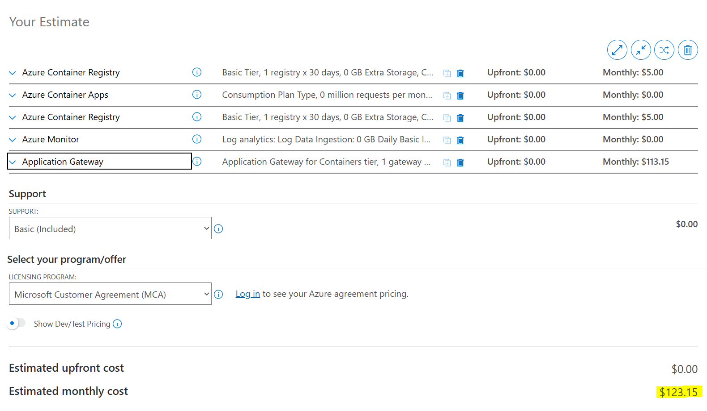
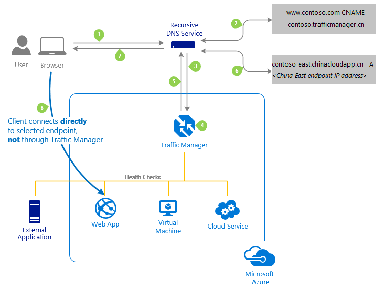
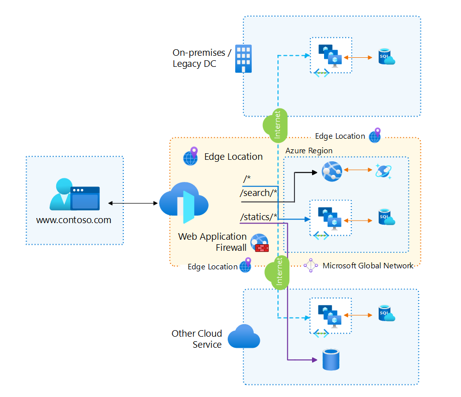
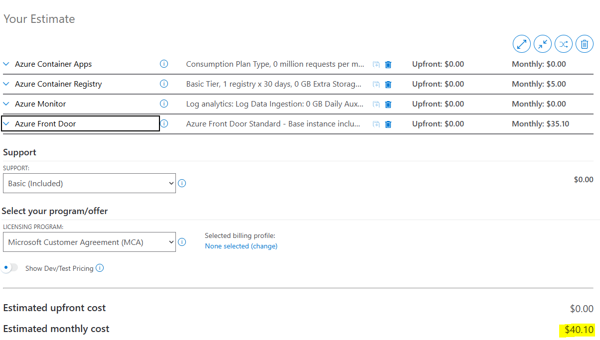
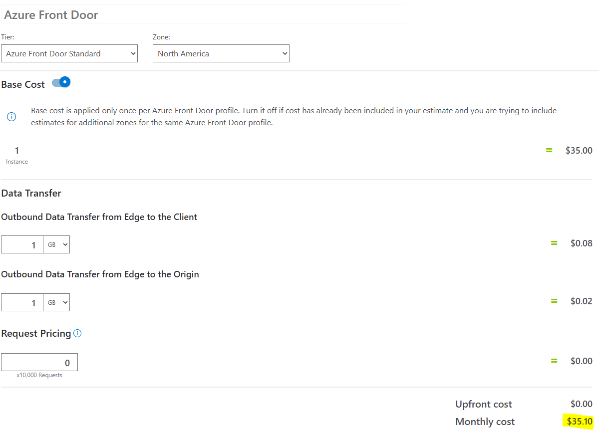

# Load Balancing Options for Azure Container Apps

 

## Overview
This document is not intended as detailed deployment instructions for the three mentioned load balancing options.

This document outlines the available load balancing options for Azure Container Apps, focusing on three key services:

1. **Azure Application Gateway for Containers**
2. **Azure Traffic Manager**
3. **Azure Front Door**

Each option will be evaluated based on its architecture, implementation options, and associated costs. The final recommendation for this project is to use **Azure Front Door**.

### Use-Case Scenarios --*Under Construction*--

#### **Azure Application Gateway for Containers**
- **Best for:** Layer 7 load balancing with advanced features like SSL termination and Web Application Firewall (WAF).
- **Use Case:** Ideal for containerized workloads requiring deep integration with Azure Kubernetes Service (AKS) or standalone container apps.
- **Key Advantage:** Provides granular control over traffic routing and security.

#### **Azure Traffic Manager**
- **Best for:** DNS-based global traffic distribution and failover.
- **Use Case:** Suitable for applications requiring geographic traffic routing and disaster recovery.
- **Key Advantage:** Simple configuration for global traffic management.

#### **Azure Front Door**
- **Best for:** Global load balancing with content delivery capabilities.
- **Use Case:** Perfect for applications needing high availability, caching, and advanced security features.
- **Key Advantage:** Combines load balancing with CDN-like performance optimization.

---

## Generic Architecture being used
##### https://learn.microsoft.com/en-us/azure/well-architected/service-guides/azure-container-apps

---

## 1. Azure Application Gateway for Containers
##### https://learn.microsoft.com/en-us/azure/application-gateway/for-containers/overview

### Architecture

Why use this solution?
- Native Azure Solution
  - Because the data path is outside of the AKS cluster, you are not robbing resources from your containers.
  - Native diagnostics and Metrics
    - no need to be concerned with correct configuration of solutions like nginx
  - Built *for* containers

### Key Features
- Traffic splitting and weighted round robin
- Mutual authentication to backend targets
- Kubernetes support for Ingress and Gateway API
- Flexible deployment strategies
- Header Query Strings
- Path-based Routing
- Increased performance with near real-time updates for adding or removing pods, routes, and probes

#### Challenges this architecture solves
The ingress controller continuously monitors pod changes within your AKS cluster. Due to these rapid updates, the Application Gateway for Containers resource must queue traffic at the ARM layer while waiting for the new pod states to converge and synchronize. This queuing introduces delays, as traffic is held until the changes are fully reflected in the Application Gateway for Containers resource.

There are two different options for implementing this architecture:
- Bring your own deployment
  - You manage the following infrastructure
    - Application Gateway for Containers resource
    - Fontend public IP and FQDN
    - Associations
    - Vnet/Subnet
    - Containers
  - Use this option if:
    - Your organization *must* control the IaC for all your resources
- ALB Controller Managed
  - You do not manage any of the above listed infrastructure
  - Use this option if:
    - You organization only wants to manage Kubernetes

### Prerequisites - Install ALB Controller
- Prepare your Azure subscription:
    - Log in to Azure CLI.
    - Set the active subscription.
    - Register required resource providers.
    - Install necessary Azure CLI extensions.
- Set up an AKS cluster in a supported region:
    - Use Azure CNI or Azure CNI Overlay.
    - Enable workload identity.
- Install Helm, the open-source packaging tool for Kubernetes.

### Installation Steps
- Create a user-managed identity for the ALB Controller.
    - Federate it as a Workload Identity in the AKS cluster.
- Install the ALB Controller using Helm:
    - Specify target namespaces.
    - Set parameters for new or existing deployments.
- Verify installation:
    - Check readiness of ALB Controller pods.
    - Confirm installation of the GatewayClass `azure-alb-external` on the cluster.

## Bring your own deployment

### Deployment Steps

1. **Create Application Gateway for Containers Resource**
    - Use Azure CLI to create the resource, specifying the resource group and name.

2. **Create Frontend Resource**
    - Execute a command to create a frontend resource for the Application Gateway.

3. **Create Association Resource**
    - Reference a subnet for connectivity.
    - Ensure the subnet meets size requirements (at least a class C or larger).
    - You can reuse an existing subnet or create a new virtual network and subnet.

4. **Enable Subnet Delegation**
    - Enable delegation for the subnet to allow the Application Gateway for Containers service to function.

5. **Delegate Permissions**
    - Assign necessary roles to the managed identity for provisioning resources and joining the subnet.

6. **Create Association Resource**
    - Execute a command to create the association resource, connecting it to the referenced subnet.
    - Note: This step may take several minutes to complete.

## ALB Controller Managed

## Implementation of ALB Controller Managed

After installing your ALB Controller, these would be the general steps to finish implementing the ALB Controller Managed Gateway for your custom Kubernetes deployment:

- **Prepare Virtual Network/Subnet:**  
    - Create a new subnet if necessary, ensuring it does not overlap with existing subnets.
    - Delegate the subnet to Application Gateway for Containers.

- **Delegate Permissions:**  
    - Assign the AppGW for Containers Configuration Manager role and Network Contributor role to the managed identity.
    - Ensure the managed identity can provision resources and join the subnet.

- **Create ApplicationLoadBalancer Resource:**  
    - Define the Kubernetes namespace for the load balancer.
    - Create the ApplicationLoadBalancer resource, specifying the subnet ID for association.

- **Validate Creation:**  
    - Monitor the deployment status of Application Gateway for Containers resources.
    - Confirm the status transitions from `InProgress` to `Programmed`, indicating successful provisioning.

### Costs

---

## 2. Azure Traffic Manager
##### https://learn.microsoft.com/en-us/azure/traffic-manager/traffic-manager-overview
### Architecture

The above architectural diagram depicts how clients reach privately hosted applications through Azure Traffic Manager. For this project, remember that we are not using Azure Web Apps. The generic architecture at the beginning of this document is still being used but with Azure Traffic Manager acting as the Application Gateway for ACA. Azure Traffic manager is leveraging DNS to direct traffic to private endpoints on the application itself.

### Challenges Solved
- Provides DNS-based global traffic distribution and failover.
- Simplifies disaster recovery and geo-routing scenarios.
- Reduces latency by directing users to the nearest endpoint.

### Key Features
- DNS-based traffic routing.
- Multiple routing methods: Priority, Weighted, Performance, Geographic.
- Health probes for endpoint monitoring.
- Integration with Azure Container Apps and other Azure services.

### Implementation Options
There is only one option for setting up Traffic Manager with Azure Container Applications
### Quick Setup Recipe for Azure Traffic Manager with Container Apps

1. **Assign Public Ingress FQDNs to Each Container App**
    - Ensure each Container App has external ingress enabled.
    - Example FQDN: `myapp.<region>.azurecontainerapps.io`
    - [Microsoft Learn](https://learn.microsoft.com/en-us/azure/container-apps/ingress)

2. **Bind Custom Domain and TLS to Each Container App**
    - Add your custom domain (e.g., `www.example.com`) to every regional app.
    - Attach a TLS certificate (managed or custom) to each app.
    - This allows apps to accept the Host header and serve valid certificates.
    - [Microsoft Learn](https://learn.microsoft.com/en-us/azure/container-apps/custom-domains-certificates)

3. **Create a Traffic Manager Profile**
    - Choose a routing method: Priority (active/standby), Weighted (split), or Performance (closest).
    - [Microsoft Azure](https://learn.microsoft.com/en-us/azure/traffic-manager/traffic-manager-overview)

4. **Add Each Container App FQDN as an External Endpoint**
    - Use the ACA FQDNs as Traffic Manager endpoints (one per region).
    - [Microsoft Learn](https://learn.microsoft.com/en-us/azure/traffic-manager/traffic-manager-endpoint-types)

5. **Configure Health Probes**
    - Protocol: HTTP or HTTPS
    - Path: e.g., `/healthz` (ensure your app returns 200 OK)
    - (Optional) Add a custom header: `Host: www.example.com` for accurate probing.
    - Note: Custom headers affect probes only, not end-user traffic.
    - [Microsoft Learn](https://learn.microsoft.com/en-us/azure/traffic-manager/traffic-manager-monitoring)

6. **Point Your DNS at Traffic Manager**
    - Create a CNAME: `www.example.com` → `<profile>.trafficmanager.net`
    - For apex/root domains, use Azure DNS alias/ANAME if supported, or use Traffic Manager at `www`.
    - [Microsoft Learn](https://learn.microsoft.com/en-us/azure/dns/dns-alias)

7. **(Optional) Use ACA’s Internal Traffic Splitting for Canary Deployments**
    - Within a single region/app, ACA can split traffic between revisions.
    - Traffic Manager handles cross-region routing.
    - [Microsoft Learn](https://learn.microsoft.com/en-us/azure/container-apps/revisions)

## Gotchas & Tips

- **TLS lives at the app:**  
    Because Azure Traffic Manager (ATM) is DNS-based, clients connect directly to your Container App. Ensure the same custom domain and TLS certificate are bound to every regional app.  
    [Microsoft Learn](https://learn.microsoft.com/en-us/azure/container-apps/custom-domains-certificates)

- **Host header matters:**  
    If your app routes traffic based on the Host header, set the probe Host header in Traffic Manager so health checks succeed. This does not affect real client requests.  
    [Microsoft Learn](https://learn.microsoft.com/en-us/azure/traffic-manager/traffic-manager-monitoring)

- **Internal ACA won’t work with ATM:**  
    Traffic Manager cannot reach private/internal Azure Container Apps environments. Use external ingress, or consider Azure Front Door with Private Link for private scenarios.  
    [Microsoft Learn](https://learn.microsoft.com/en-us/azure/container-apps/networking)

- **Need edge WAF, caching, IPv6, or STA?**  
    Consider Azure Front Door instead of (or in front of) Traffic Manager. Azure Front Door acts as a reverse proxy, while Traffic Manager is DNS-based. The Well-Architected guide discusses both options.  
    [Microsoft Learn](https://learn.microsoft.com/en-us/azure/frontdoor/front-door-overview)

- **TTL setting must be balanced**
    Consider the TTL setting carefully for implementation of Traffic Manager with Azure Container Apps. Lower TTL settings will request updates from your application more often which means health checks will be more up to date but also, your costs will rise more rapidly. Inversely a higher TTL setting will mean slower up to date health information but costs will be lower.

### Costs

- [Pricing structure for Traffic Manager](https://azure.microsoft.com/en-us/pricing/details/traffic-manager/)

### Documentation
- https://learn.microsoft.com/en-us/azure/traffic-manager/traffic-manager-endpoint-types
- https://learn.microsoft.com/en-us/azure/traffic-manager/traffic-manager-monitoring
- https://learn.microsoft.com/en-us/azure/container-apps/custom-domains-certificates
- https://learn.microsoft.com/en-us/azure/well-architected/service-guides/azure-container-apps
- https://learn.microsoft.com/en-us/azure/container-apps/rule-based-routing-custom-domain
- https://learn.microsoft.com/en-us/azure/container-apps/networking
- https://learn.microsoft.com/en-us/azure/traffic-manager/traffic-manager-faqs
---

## 3. Azure Front Door
##### https://learn.microsoft.com/en-us/azure/frontdoor/front-door-overview
### Architecture

Use Azure Front Door whenever you need global, secure, L7-aware routing with CDN-like performance, integrated security, and flexible, programmable behavior. For simpler DNS-based failover without edge-level capabilities, consider Traffic Manager instead.

### Challenges Solved
- Provides global, secure, Layer 7-aware routing.
- Enhances performance with CDN-like caching and acceleration.
- Protects applications with integrated Web Application Firewall (WAF).

### Key Features
- Global load balancing with edge acceleration.
- SSL offloading and end-to-end TLS.
- Integrated Web Application Firewall (WAF).
- Rules engine for advanced traffic management.

### Implementation Options

#### Deploying Azure Front Door with Bicep

- Integrate Azure Front Door (AFD) into your deployment using Bicep templates for Infrastructure as Code (IaC).
- Reference the latest Azure Front Door Bicep modules and API versions for optimal security and feature support.
- Example: Use the official [Azure Front Door Bicep documentation](https://learn.microsoft.com/en-us/azure/templates/microsoft.cdn/profiles) for resource definitions.

#### Performance and Security Best Practices

- **General Guidance:**  
    - Prefer Azure Front Door for advanced routing, caching, and TLS termination.  
    - Use either Azure Front Door or Azure Traffic Manager, not both, unless a specific hybrid scenario is required.  
    - Block direct access to origin servers to ensure all traffic flows through Front Door.

- **API and SDK Usage:**  
    - Always use the latest API and SDK versions for improved security and functionality.

- **Logging Configuration:**  
    - Enable diagnostic logging to monitor requests and analyze application performance.

- **TLS Best Practices:**  
    - Enforce end-to-end TLS for all connections.  
    - Redirect HTTP traffic to HTTPS.  
    - Use managed TLS certificates to simplify management and reduce operational overhead.

- **Domain Name Best Practices:**  
    - Use custom domains for Front Door endpoints.  
    - Avoid hardcoding Azure-provided domains.  
    - Ensure consistent domain names between Front Door and origin services.

- **Web Application Firewall (WAF):**  
    - Enable WAF for all internet-facing applications.  
    - Configure managed rule sets for protection against common threats.

- **Health Probe Best Practices:**  
    - Disable health probes if only one origin exists in an origin group.  
    - Select appropriate endpoints for health probes.  
    - Prefer HEAD requests for health probes to minimize origin load.

---

### Costs
- Pricing tiers for Azure Front Door.
  - Classic (Deprecated)
  - Standard
  - Premium

- Cost analysis for expected traffic and feature usage.
### No additional fees are charged to use these features.
- Traffic acceleration
- Response caching
- Response compression
- Rules engine
- Front Door's inherent DDoS protection
- Custom web application firewall (WAF) rules
- Managed WAF rule sets (Front Door Premium)
- Private Link origins (Front Door Premium)

### Documentation
#### https://learn.microsoft.com/en-us/azure/frontdoor/front-door-overview

---

## Recommendation
Based on the evaluation of architecture, implementation options, and costs, **Azure Front Door** is the recommended load balancing solution for this project. It provides:

- Global load balancing with high availability.
- Advanced security features:
  - TLS termination
  - DDoS edge protection
  - global POPs
  - origin shielding.
- Cost-effective scaling for expected traffic patterns.

---

## Next Steps
- Proceed with the implementation of Azure Front Door.
- Monitor performance and costs post-deployment.
- Optimize configuration based on usage patterns.
