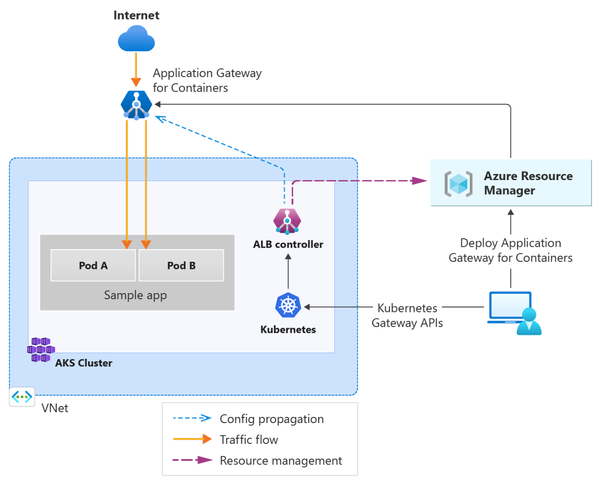
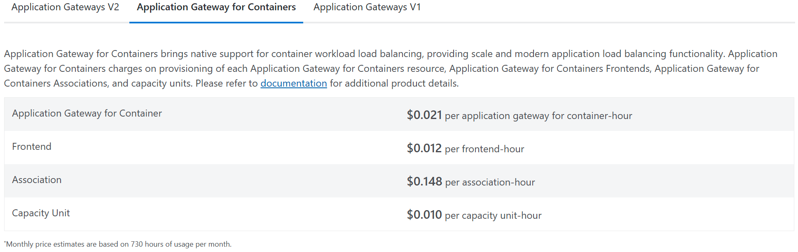

# Load Balancing Options for Azure Container Apps

 

## Overview
This document is not intended as detailed deployment instructions for the three mentioned load balancing options.

This document outlines the available load balancing options for Azure Container Apps, focusing on three key services:

1. **Azure Application Gateway for Containers**
2. **Azure Traffic Manager**
3. **Azure Front Door**

Each option will be evaluated based on its architecture, implementation options, and associated costs. The final recommendation for this project is to use **Azure Front Door**.

### Use-Case Scenarios --*Under Construction*--

#### **Azure Application Gateway for Containers**
- **Best for:** Layer 7 load balancing with advanced features like SSL termination and Web Application Firewall (WAF).
- **Use Case:** Ideal for containerized workloads requiring deep integration with Azure Kubernetes Service (AKS) or standalone container apps.
- **Key Advantage:** Provides granular control over traffic routing and security.

#### **Azure Traffic Manager**
- **Best for:** DNS-based global traffic distribution and failover.
- **Use Case:** Suitable for applications requiring geographic traffic routing and disaster recovery.
- **Key Advantage:** Simple configuration for global traffic management.

#### **Azure Front Door**
- **Best for:** Global load balancing with content delivery capabilities.
- **Use Case:** Perfect for applications needing high availability, caching, and advanced security features.
- **Key Advantage:** Combines load balancing with CDN-like performance optimization.

---

## Generic Architecture being used
#### https://learn.microsoft.com/en-us/azure/well-architected/service-guides/azure-container-apps

---

## 1. Azure Application Gateway for Containers
#### https://learn.microsoft.com/en-us/azure/application-gateway/for-containers/overview

### Architecture

There are two different options for implementing this architecture:
- Bring your own deployment
- ALB Controller Managed

### Prerequisites - Install ALB Controller
- Prepare your Azure subscription:
    - Log in to Azure CLI.
    - Set the active subscription.
    - Register required resource providers.
    - Install necessary Azure CLI extensions.
- Set up an AKS cluster in a supported region:
    - Use Azure CNI or Azure CNI Overlay.
    - Enable workload identity.
- Install Helm, the open-source packaging tool for Kubernetes.

### Installation Steps
- Create a user-managed identity for the ALB Controller.
    - Federate it as a Workload Identity in the AKS cluster.
- Install the ALB Controller using Helm:
    - Specify target namespaces.
    - Set parameters for new or existing deployments.
- Verify installation:
    - Check readiness of ALB Controller pods.
    - Confirm installation of the GatewayClass `azure-alb-external` on the cluster.

## Bring your own deployment

### Deployment Steps

1. **Create Application Gateway for Containers Resource**
    - Use Azure CLI to create the resource, specifying the resource group and name.

2. **Create Frontend Resource**
    - Execute a command to create a frontend resource for the Application Gateway.

3. **Create Association Resource**
    - Reference a subnet for connectivity.
    - Ensure the subnet meets size requirements (at least a class C or larger).
    - You can reuse an existing subnet or create a new virtual network and subnet.

4. **Enable Subnet Delegation**
    - Enable delegation for the subnet to allow the Application Gateway for Containers service to function.

5. **Delegate Permissions**
    - Assign necessary roles to the managed identity for provisioning resources and joining the subnet.

6. **Create Association Resource**
    - Execute a command to create the association resource, connecting it to the referenced subnet.
    - Note: This step may take several minutes to complete.

## ALB Controller Managed

## Implementation of ALB Controller Managed

After installing your ALB Controller, these would be the general steps to finish implementing the ALB Controller Managed Gateway for your custom Kubernetes deployment:

- **Prepare Virtual Network/Subnet:**  
    - Create a new subnet if necessary, ensuring it does not overlap with existing subnets.
    - Delegate the subnet to Application Gateway for Containers.

- **Delegate Permissions:**  
    - Assign the AppGW for Containers Configuration Manager role and Network Contributor role to the managed identity.
    - Ensure the managed identity can provision resources and join the subnet.

- **Create ApplicationLoadBalancer Resource:**  
    - Define the Kubernetes namespace for the load balancer.
    - Create the ApplicationLoadBalancer resource, specifying the subnet ID for association.

- **Validate Creation:**  
    - Monitor the deployment status of Application Gateway for Containers resources.
    - Confirm the status transitions from `InProgress` to `Programmed`, indicating successful provisioning.

### Key Features
- Traffic splitting and weighted round robin
- Mutual authentication to backend targets
- Kubernetes support for Ingress and Gateway API
- Flexible deployment strategies
- Increased performance with near real-time updates for adding or removing pods, routes, and probes

### Implementation Options
- Steps to deploy Application Gateway for Containers.
- Integration with Azure Kubernetes Service (AKS) or standalone container apps.

### Costs --*Under Construction*--
- Pricing model for Application Gateway.
- Cost considerations for scaling and additional features like WAF.

---

## 2. Azure Traffic Manager

### Architecture

- Overview of Traffic Manager's DNS-based load balancing.
- Use cases for global traffic distribution and failover.

### Implementation Options
- Configuration steps for Traffic Manager profiles.
- Integration with Azure Container Apps and other Azure services.

### Costs
#### Costs

- Pricing structure for Traffic Manager.
- Cost implications for high-traffic scenarios.

---

## 3. Azure Front Door

### Architecture
- Explanation of Front Door's global load balancing and content delivery capabilities.
- Key features such as SSL offloading, caching, and WAF.

### Implementation Options
- Steps to configure Azure Front Door for Azure Container Apps.
- Best practices for optimizing performance and security.

### Costs
- Pricing tiers for Azure Front Door.
- Cost analysis for expected traffic and feature usage.

---

## Recommendation
Based on the evaluation of architecture, implementation options, and costs, **Azure Front Door** is the recommended load balancing solution for this project. It provides:

- Global load balancing with high availability.
- Advanced security features like WAF.
- Cost-effective scaling for expected traffic patterns.

---

## Next Steps
- Proceed with the implementation of Azure Front Door.
- Monitor performance and costs post-deployment.
- Optimize configuration based on usage patterns.
